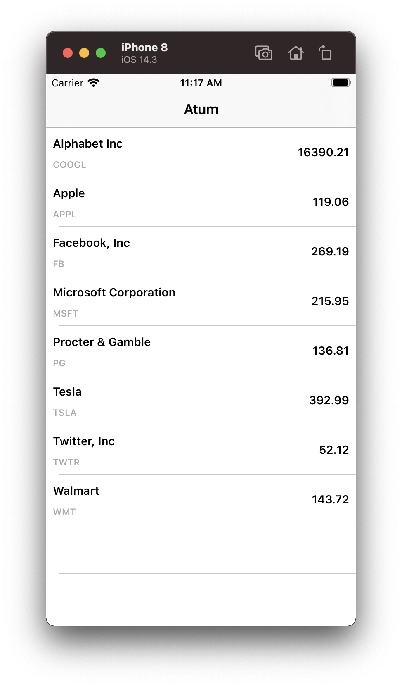
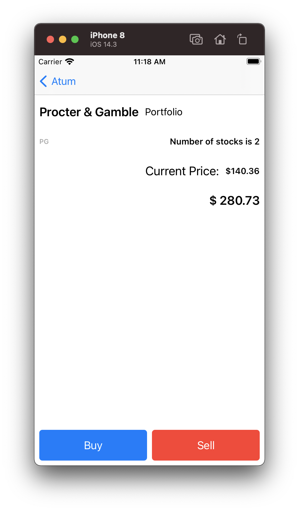

# Provided Code

You are provided with a skeleton Xcode project that contains:

Two separate teams have created stock trading code. This code is shared by other platforms so it should not be changed.

- **StockRepository** provides two functions to get stock related information:
	- `getAllStocks()` provides a full list of all the stocks and their last known price
	- `getSpecificStock()` provides the current details of any stock given its stockTicker
- There is also a notification **didReceiveStockUpdate**, that sends out updated stock info.
- The `UserInfo` dictionary contains a **stockInfoKey** with an array of updated stocks
- **PortfolioRepository** provides three functions related to the current portfolio:
	- `portfolio(stockTicker: String)` return a PortfolioStatus struct with number of stocks in the portfolio of a stock
	- `buy()` initiates a purchase of a given number of stocks
	- `sell()` initiates a sale of a given number of stocks. This call throws the **ErrorBuying.minimumNumberOfStocks** error if there are not enough stocks left to sell

The idea is to integrate **StockRepository** and **PortfolioRepository** so that from the list of stocks you can go into the portfolio of that stock and buy and sell stocks of that type.

**SpinnerViewController** class is also provided in case you want to use it for showing indeterminate progress during network delays

***
## Task list

At a minimum please complete the following
- Handle row selection in the table to show the stock detail
- Update the stock detail to show the actual value for the stock
- Hook up the buy and sell button to call the PortfolioRepository
- Handle the error of selling too many

Then if you have time
- Handle the network delay on buying and selling stocks with the spinner class instead of locking up the UI
- Process the notifications of new stock prices and change the color of the price to be red if the price went down and green if it went up.
- Fix any obvious errors or layout problems (try it on iPhone 8 and 10)

***
## Screen Shots
   

***
## Consider the following for your challenge:
- The StockRepository gives a partial list of stocks in their updates
- The challenge is pretty extensive, and we do not expect you to fully complete it
- Looking at code you have written previously or StackOverflow is not cheating, but it might slow you down
- The provided project uses MVVM but knowledge of this architecture is a bonus and you should not need to know it to finish

