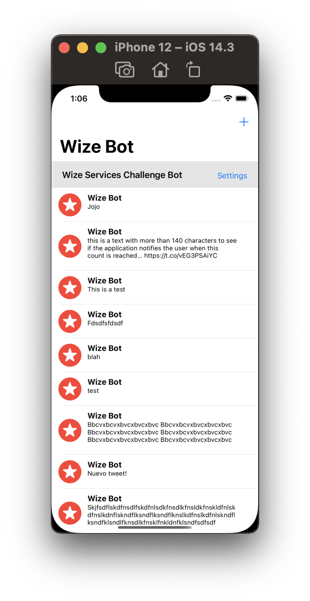
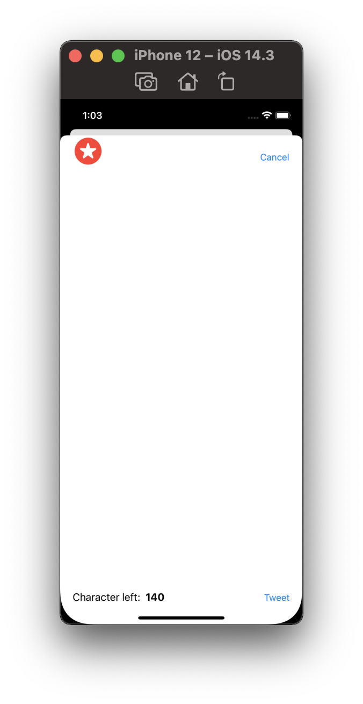
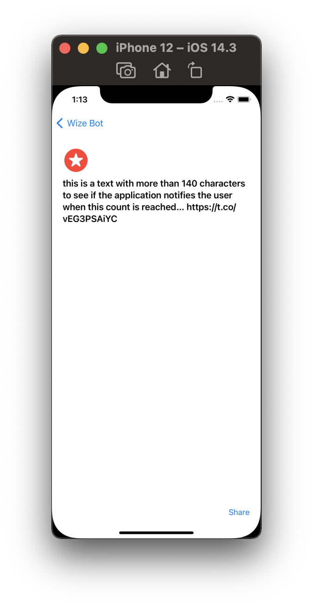

# Provided Code

You are provided with a skeleton Xcode project that contains:

- **Tweet** and **UserProfile** models that you should not need to change
- **ViewModelHelper** with the following methods:
	- **loadUserProfile(locally:Bool, completion:)** to load the user profile either locally from a file or from the internet
	- **loadTweets(locally: Bool, completion)** to similarly load the tweets
	- **userProfileViewModel()** returns the viewModel of the user profile
	- **tweetCount()** returns the total number of tweets
	- **tweetViewModel(at index: Int)** returns the view model of a specific tweet
- **TweetViewModel** and **UserProfileViewModel** that can be added to in order to provide model data to the view controllers
- **TweetTableViewController** is a skeleton of a table view controller that currently only loads the user profile and tweets

# Task list

- **You can complete the following in any order:**

	
	In the tweet list:
	1) Add the User name in the Navigation Bar
	2) Fix the table view to show a list of Tweets with the User Name and Tweet description
	3) Create a text button for Settings in SectionHeaderView.swift
	4) Create an **add** system barButtonItem for new Tweets and hook it up to `addTweet()`
	5) Make the tweet text cell grow to the length of the text   
	
	

	In the New Tweet view:

	6) Focus the text view when the view appears
	7) Keep the Tweet button and Character count the standard distance from the bottom of the visible area
	8) Cancel and tweet button only dismiss the UI for now
	9) Limit characters to 140 characters and update the characters left

## Optionally

1) Switch the tweets to loading from the network
2) Show a new cell with “Loading” when there are no tweets to show yet
3) Set the section header height to zero in Landscape
4) When the user clicks on a tweet, push the details with a Navigation Controller

  

5) Replace the stock image using GCD using the UserProfile `profileImageURLHTTPS` and `Data(contentsOf: url)`
6) Hook up the Share button
7) Add a cancel: button to the top right of the New Tweet view in the Storyboard and hook it up